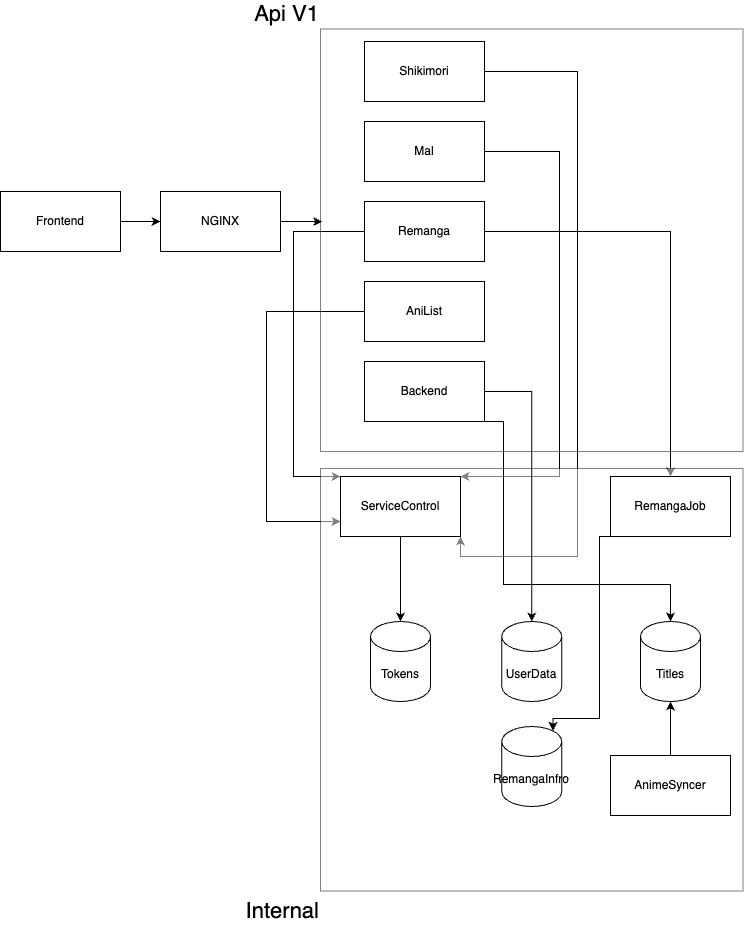

# 🌸 AnimeUtils 

> **AnimeUtils** — мультисервисный REST API и UI для синхронизации списков аниме и манги между популярными сервисами, такими как: Shikimori, AniList и Remanga

---

## 📌 О проекте

AnimeUtils позволяет:
- 🔄 Синхронизировать данные между платформами
- 🔐 Авторизоваться через внешние сервисы (OAuth2)
- 📥 Импортировать и 📤 экспортировать списки
- 🖥️ Использовать единый веб-интерфейс

---

## 🛠️ Используемые технологии

| Технология                                                                          | Применение                                                    |
|-------------------------------------------------------------------------------------|---------------------------------------------------------------|
|         | Язык программирования для микросервисов и обработки данных    |
|       | Основной REST API фреймворк                                   |
|           | Дополнительные вспомогательные сервисы                        |
|  | Типизированный язык для клиентской и служебной логики         |
|           | Фронтенд-интерфейс (SPA)                                      |
|  | Основная реляционная база данных                              |
|           | Хранилище кеша и вспомогательных структур                     |
|    | Очереди сообщений и микросервисное взаимодействие             |
|           | Веб-сервер и обратный прокси                                  |
|          | Авторизация через внешние платформы (Shikimori, AniList, Remanga) |
|       | Локальное хранилище списка манги и аниме                      |
|        | Язык программирования для микросервисов и обработки данных                                                              |

---

## 🧩 Сервисы

| Сервис | Стек                          | Описание                 | Документация |
|--------|-------------------------------|--------------------------|--|
| **Frontend** | React, TypeScript             | UI-интерфейс пользователя | [Docs](https://github.com/Junketsu-stacking/WebSiteFrontend) |
| **Backend API** | FastAPI, Kafka, PostgreSQL    | Работа с пользователем в нашей системе | <!-- TODO: docs link --> |
| **Shikimori API Service** | Flask, OAuth, GraphQL         | Интеграция и импорт/экспорт из Shikimori | <!-- TODO --> |
| **AniList API Service** | DotNet, GraphQL               | Интеграция с AniList (GraphQL) | <!-- TODO --> |
| **Remanga API Service** | TypeScript, NodeJS            | Работа с мангой: главы, истории | <!-- TODO --> |
| **MAL API Service** | DotNet                        | Поддержка MyAnimeList    | <!-- TODO --> |
| **Access Controller** | TypeScript, NodeJS, Redis     | Генерация и валидация токенов | <!-- TODO --> |
| **Anime Syncer** | Kafka, Redis, TypeScript, NodeJS | Асинхронная синхронизация данных | <!-- TODO --> |
| **Remanga Job** | TypeScript, NodeJS, Cron, Redis, MongoDB | Джобы на прочтения манги | <!-- TODO --> |

---

## 📊 Архитектура микросервисов

👁️ Нажмите, чтобы раскрыть архитектурную схему

---

## 🖼️ Примеры интерфейса

🧪 Визуальный интерфейс (скриншоты)

<table>
  <tr>
    <td align="center">
      <strong>Главная страница</strong> 
      " alt="Dashboard" />
    </td>
    <td align="center">
      <strong>Профиль пользователя</strong> 
      " alt="Profile" />
    </td>
  </tr>
</table>

---

## 📚 Основные возможности

- 🔐 Авторизация через Shikimori / AniList / Remanga
- 🔄 Синхронизация и кеширование данных
- 📥 Импорт / 📤 Экспорт контента
- 🖼️ UI-фильтры, сортировка, теги
- 👥 Связывание аккаунтов
- 📈 Расширяемая архитектура

---

## 🛣️ Дорожная карта

| Фича                     | Статус        |
|--------------------------|---------------|
| Поддержка MAL            | ⏳ В планах    |
| Telegram-бот             | ⏳ В планах |
| Админка и модерация      | ⏳ В планах |
| UI-фильтры и тёмная тема | ⏳ В планах      |
| CI/CD + Docker сборка    | 🚧 В разработке      |
| Поддержка AniList        | ⏳ В планах      |

---

## 🛡️ Безопасность

- 🧾 JWT токены
- 🔐 OAuth2 авторизация
- 📡 Все соединения через HTTPS
- 🧊 Хеширование чувствительных данных

---

## 🙌 Вклад

Мы открыты к любому вкладу!  
Присоединяйтесь к разработке через [Pull Requests](https://github.com/Junketsu-stacking/AnimeUtils/pulls) или оставляйте [Issues](https://github.com/Junketsu-stacking/AnimeUtils/issues).

📘 См. [CONTRIBUTING.md](./CONTRIBUTING.md)

---

## 📜 Лицензия

MIT License © [Junketsu Team](https://github.com/Junketsu-stacking)

---
